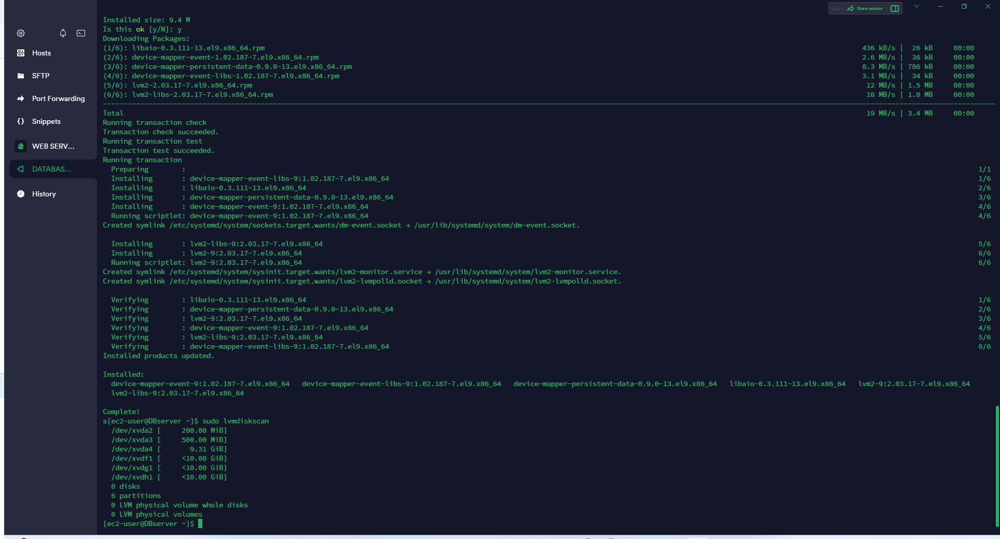
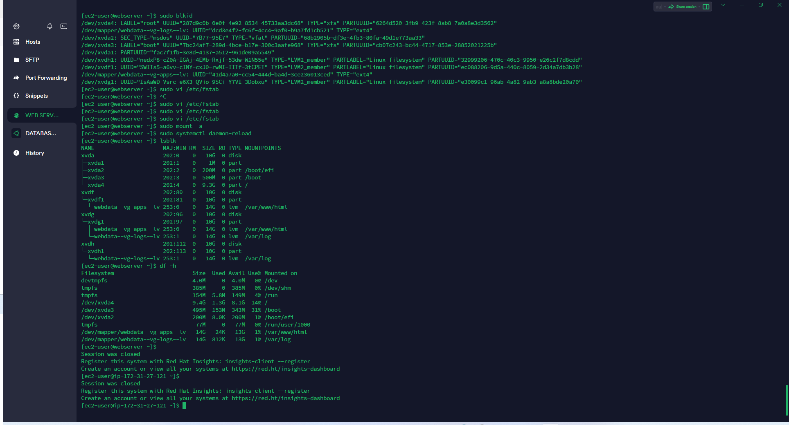

## **Documentation for Project 6**

### Entire View of the newly created Block Devices 

`lsblk`

### Partioning Block Devices
`sudo gdisk /dev/xvdf`
`sudo gdisk /dev/xvdg`
`sudo gdisk /dev/xvdh`

### Entire View of all Partitioned Block
`lsblk`

### LVM2 Installation
`sudo yum install lvm2`

### LVM2 Installed
`sudo lvmdiskscan`

### Marking the Partitions as Physical Volumes
`sudo pvcreate /dev/xvdf1 /dev/xvdg1 /dev/xvdh1`
`sudo pvs`

### Creating-Volume-Group
`sudo vgcreate webdata-vg /dev/xvdh1 /dev/xvdg1 /dev/xvdf1`
`sudo vgs`

### Creating-Logical-Volumes
`sudo lvcreate -n apps-lv -L 14G webdata-vg`
`sudo lvcreate -n logs-lv -L 14G webdata-vg`
`sudo lvs`

### Formatting-Logical-Volumes-with-EXT4-Filesystem
`sudo mkfs -t ext4 /dev/webdata-vg/app-lv`
`sudo mkfs -t ext4 /dev/webdata-vg/logs-lv`

### Creating-Directory-to-Store-website-files and mounting web files
`sudo mkdir -p /var/www/html`

### Creating-Directory-to-Store-Log-Files and mount log files
`sudo mkdir -p /home/recovery/logs`

### Updating-fstab
`sudo vi /etc/fstab`

### Entire-setup-of-Volumes
`df -h`

## **Preparing Database Server**

### Volumes-Attached-for-DB-Server
`lsblk`

### Volumes-successfully-partitioned
`sudo gdisk /dev/xvdf`
`sudo gdisk /dev/xvdg`

### Volumes-marked-as-physical-volumes
`sudo pvcreate /dev/xvdf1 /dev/xvdg1 /dev/xvdh1`

### Installing LVM2 for DB Server
`sudo yum install lvm2`
`sudo lvmdiskscan`

### Creating Volume Groups for DBServer and Logical Volume
`sudo vgcreate vg-dbdatabase /dev/xvdf1 /dev/xvdg1 /dev/xvdh1`
`sudo vgs`
`sudo lvcreate -n db-lv -l 14G vg-dbdatabase`
`sudo lvs`

### Formatting-Logical-Volumes-with-EXT4-Filesystem
`sudo mkfs -t ext4 /dev/vg-dbdatabase/db-lv`

### Logical Volume Mounted on DB Directory
`sudo mount /dev/vg-dbdatabase/db-lv /db`
`sudo mount -a`

### Updating fstab for DB
`sudo vi /etc/fstab`

### mysql installation on DBServer
`sudo yum update`
`sudo yum install mysql-server`

## **Installing Wordpress on Webserver**
### Installing wget and its dependencies
`sudo yum -y install wget httpd php php-mysqlnd php-fpm php-json`

## **Installing PHP and it's dependecies**
##### Had to use another repo and key from php documentation
`sudo yum install https://dl.fedoraproject.org/pub/epel/epel-release-latest-8.noarch.rpm`
`sudo yum install yum-utils http://rpms.remirepo.net/enterprise/remi-release-8.rpm`
`sudo yum module list php`
`sudo yum module reset php`
`sudo yum module enable php`
`sudo yum install php php-opcache php-gd php-curl php-mysqlnd`

### Download wordpress and copy wordpress to var/www/html
` mkdir wordpress`
`cd wordpress`
`sudo wget http://wordpress.org/latest.tar.gz`
`cp -R wordpress /var/www/html/`

### Configuring SElinux Policies
`sudo chown -R apache:apache /var/www/html/wordpress`

`sudo chcon -t httpd_sys_rw_content_t /var/www/html/wordpress -R`

`sudo setsebool -P httpd_can_network_connect=1`

### Configure DB to work with WordPress
`show databases`

### Configure WordPress to connect to remote database
`sudo mysql -u myuser -p -h 172.31.22.12`

### link to WordPress accessed from Browser
`http://3.140.246.8/wordpress/`

### WordPress successfully Deployed
`http://3.140.246.8/wordpress/`
